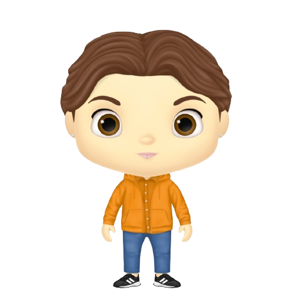
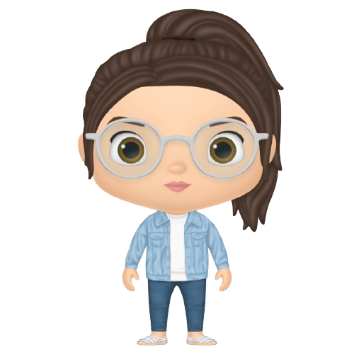

# ProyectoAigues
# App Museu de les Aigües 💦 

"El agua no es solo un derecho humano, es un derecho de toda la naturaleza."
"La escasez de agua es un desafío global, pero las soluciones comienzan localmente."
"El agua es la sangre de la Tierra; si se seca, nos secamos con ella."
"La conservación del agua no es un acto de sacrificio, es un acto de amor por la vida."

##### Nuestra misión:
El objetivo principal de nuestro proyecto es crear una aplicación gamificada que enriquezca la experiencia de la comunidad en relación al consumo del agua, haciéndola más envolvente y educativa.

Al empezar este proyecto, resultó imposible no tener en cuenta la actual situación de sequía en Barcelona y deseamos que nuestra visión de proyecto pueda formar parte del auxilio a la comunidad en este momento difícil.

##### ¿Qué puedes encontrar en nuestra App? ⌨️

    Nuestra aplicación utiliza la gamificación para motivar a los usuarios 
    a alcanzar objetivos y aprender sobre la importancia del agua. 

    Como herramienta educativa, nuestro proyecto tiene como objetivo 
    concientizar sobre la historia, uso y conservación del agua, 
    destacando su valor como recurso natural y fomentando su uso responsable. 
    
    La trivia educativa incluye preguntas adaptadas a preocupaciones 
    sobre el uso eficiente y la conservación del agua.


Descarga la aplicación ahora y únete!!!.


## Empezando 🚀

Estas instrucciones te guiarán para obtener una copia de este proyecto en funcionamiento en tu máquina local para propósitos de desarrollo y pruebas.


| Repo / Deploy / Documentación   | Descripción del Proyecto                                                                           |
| -------- | ------------------------------------------------------------------------------------- 
| [](https://github.com/Codecrafters06/ProyectoAigues) [](https://museodelasaiguas.netlify.app/) [](https://proyectoaigues-production.up.railway.app/api) [](https://museudelesaigues.up.railway.app) | Proyecyo principal. App Gamificada en una trivia temática en torno a la consciencia del Agua como recurso|
[](https://github.com/Codecrafters06/DropiAR)  [	](https://codecrafters06.github.io/DropiAR/)| Realidad Aumentada - Avatar Dropi como guía en el aprendizaje sobre el cuidado y la preservación del Agua|

## Development team ✒️


### Inno Melkonjan - Frontend development - Figma - Testing [](https://www.linkedin.com/in/inno-melkonjan/ "Connect on LinkedIn") [](https://github.com/Innovaton0)


### Isadora Matías - Product Owner - Backend development - Figma - MongoDb [](https://www.linkedin.com/in/isadoramatias/ "Connect on LinkedIn") [](https://github.com/IsadoraMatias)


### Pamela Baez - Backend development, Researching [](https://www.linkedin.com/in/pamela-baez-/ "Connect on LinkedIn") [](https://github.com/pamelab182)



### Sebastian Forero - Frontend - Deploypment - Researching [](https://www.linkedin.com/in/sebasti%C3%A1nforerogiraldo/ "Connect on LinkedIn") [](https://github.com/sefogi)


### Wilfred Liñan - Backend development, Aumented Reality [](https://www.linkedin.com/in/wilfredolinan/ "Connect on LinkedIn") [](https://github.com/wilpipe)



### Mava Figallo - Scrum Master - Frontend development, Researching [](https://github.com/mavafiza "Connect on LinkedIn") [](https://github.com/mavafiza) 

---
## Instalación 🔧
### Pasos para inicializar la aplicación y requisitos necesarios.

- [](https://code.visualstudio.com/download) Para poder inicializar el proyecto necesitaremos un editor de codigo fuente, por ejemplo VS CODE. 


-  Necesitaremos instalar NodeJs para poder levantar el backend o tocar codigo.

-  Necesitaremos iniciar nuestro proyecto react en nuestro editor, abriendo el terminal con este comando ```pnpm init``` para instalar las dependencias

-  En este caso como el proyecto ya esta iniciado valdra con poner en el terminal: ```pnpm install```  , esto instalara todas las dependencias necesarias.

-  Para la base de datos la tenemos a traves de MongoDB.


-  Una vez todo instalado usaremos el comando ```pnpm run start:dev``` para levantar el backend y ```pnpm run dev``` para levantar el frontend

-  Para poder realizar los test desarrollados lo podremos hacer desde frontend con el comando ```pnpm test``` y de la misma manera desde el backend con el comando ```pnpm test:watch``` o ```pnpm test``` 


#  Descripción del proyecto 📋
Nos han pedido que hagamos una aplicación gamificada y hemos desarrollado una trivia a la par de una proyección de Realidad Aumentada!

En principio la trivia se desarrolla en el contexto de la escenificación de tres personajes en la propuesta inicial que engloban el contexto del juego, ofreciendo al usuario escoger entre los personajes y escenarios donde se desarrollará su triva y que estarán definidas por estos, de acuerdo a la personalidad de cada uno de los personajes y el escenario donde estos se encuentren.

## Tecnologías utilizadas 🛠️
 


      	  	   	       	     	      	  


# Planificación
Hemos utilizado Miro para crear tableros donde tener accesibles todos los documentos de planificación: brain stormings, calendarios de trabajo, user stories mapping, roadmaps, convenciones, kanban, roles y funciones.

[Ver TABLERO DE PLANIFICACIÓN ](https://miro.com/app/board/uXjVNjDp9r8=/)


## Presentación PDF 📄

## Expresiones de Gratitud 🎁

Agradecemos principalmente a Factoriá F5 por la oportunidad y el habernos seleccionado...
Al staff que dirigió nuestra promoción, Raúl García (formador titular), Judith Lloveras (Responsable de promoción) y Rocío Cejudo(co-formadora) 

También agradecemos al Canodrom, que nos abrió sus puertas para la impartición en los días presenciales...

Además, extendemos nuestro sincero agradecimiento al Museu de les Aigües y a Marta Soler por su continua confianza y respaldo durante el desarrollo de este proyecto. Su apoyo ha sido fundamental para su éxito.

Especial agradecimiento a los mentores, profesionales y formadores que de manera voluntaria ofrecieron sus conocimientos en Master Clases y mentorías para incrementar nuestra curva de aprendizaje...

Gracias a las empresas que de alguna manera están involucradas en el programa, dando soporte o permitiéndonos conocer la realidad profesional del sector, entre ellas: Thoughtworks, Esade, Basetis, Globant y Meetup de donde nos llevamos recuerdos y experiencias inéditas.

Muy especial gratitud a Ana Karen Aragón y Jorge Benitez del bootcamp de inmersiva quienes tuvieron la buena voluntad de adentrarnos en el mundo de la Realidad Aumentada para implementarla en este proyecto 

... a nuestros compañeros de camino...los que se quedaron en algún punto y los que cumlinan junto a nosotros...todos fueron parte de esto... Keep in touch for ever...!!!

...y el agradecimiento más profundo a todo nuestro equipo de proyecto... siempre con las mejores ganas y optimismo aunque pareciese imposible... Equipo, fue posible...✌!!! Kudos Kudos Kudos...!!!


